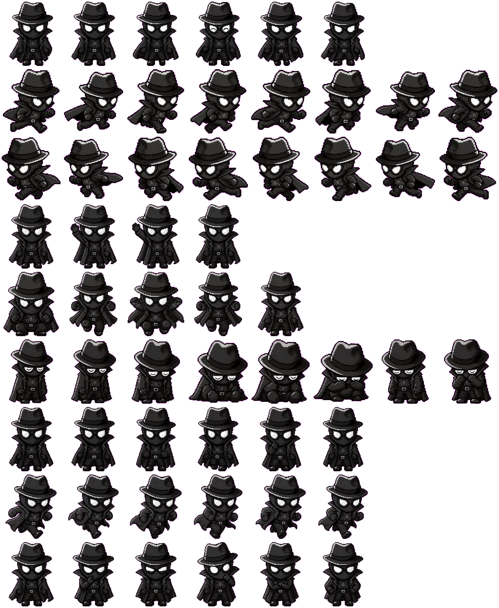

<p align="center">
  
</p>

<h1 align="center">🐾 Purr Pilot — 你的 AI 桌面宠物伙伴</h1>

<p align="center">
  <strong>住在你桌面上的 AI 宠物，能聊天陪伴、能思考、能帮你工作。</strong>
</p>

<p align="center">
  
  
  
  
</p>

<p align="center">
  <a href="README.en.md">English</a> · 中文
</p>

---

> **Purr Pilot** 不只是一个桌面挂件——它是一个拥有记忆、技能和社交圈的 AI 伙伴。它常驻在你的桌面上，随时准备聊天、回答问题、播放音乐、管理任务，甚至通过语音跟你对话。所有数据完全本地存储，隐私零担忧。

---

## ✨ 核心亮点

<table>
<tr>
<td width="50%">

### 🖥️ 桌面常驻宠物
透明置顶窗口，可自由拖拽到屏幕任意位置。右键唤出快捷面板：闪聊、音乐播放器、用量看板，无需打开主窗口即可交互。

</td>
<td width="50%">

### 🧠 AI 对话 & 记忆
多会话聊天支持 Markdown 渲染、流式输出和生成式交互卡片。AI 会主动提议记忆摘要，帮宠物记住你的偏好和习惯。

</td>
</tr>
<tr>
<td>

### 🎤 语音对话
支持语音输入转写和 TTS 语音播报，开启「语音循环」后可全程语音免打字交互。可接入已支持的语音 API，包括小米 MiMo、OpenAI 以及兼容 OpenAI 语音协议的端点。

</td>
<td>

### 🎨 形象自定义 & Petdex 图鉴
从 **18 款预设角色** 中挑选，或上传任意图片——自动抠图、三层拆件、生成 Petdex 动作图集。你的宠物，你做主。

</td>
</tr>
<tr>
<td>

### 🔌 多模型自由切换
开箱即用支持 DeepSeek、OpenAI、Anthropic、Google Gemini、xAI、OpenRouter 及任意 OpenAI 兼容端点。一键切换，不绑定任何平台。

</td>
<td>

### 👥 社交与技能交换
添加好友，组建你的宠物社交圈。朋友之间可以互相交换技能和记忆——让你的宠物越来越强大。

</td>
</tr>
</table>

---

## 🎬 功能演示

<!-- 
  📌 GIF Demo 预留区
  将录制好的 GIF 放入仓库（建议路径：docs/demos/），然后替换下方占位图。
  推荐尺寸：800×500 左右，GIF 控制在 5MB 以内。
-->

<table>
<tr>
<td align="center" width="50%">

<!-- TODO: 替换为桌面宠物交互 GIF -->


**桌面宠物 · 随时待命**
<sub>透明置顶 · 自由拖拽 · 右键快捷面板</sub>

</td>
<td align="center" width="50%">

<!-- TODO: 替换为 AI 聊天 GIF -->


**AI 聊天 · 流式响应**
<sub>多会话 · Markdown 渲染 · 生成式交互卡片</sub>

</td>
</tr>
<tr>
<td align="center">

<!-- TODO: 替换为形象自定义 GIF -->


**形象工作室 · 你的宠物你做主**
<sub>上传图片 · 自动抠图拆件 · 生成动作图集</sub>

</td>
<td align="center">

<!-- TODO: 替换为语音对话 GIF -->


**语音对话 · 解放双手**
<sub>语音输入 · TTS 播报 · 全程语音循环</sub>

</td>
</tr>
</table>

---

## 🖼️ 功能一览

| 功能模块 | 说明 |
|:--|:--|
| 🏠 **主页仪表盘** | 宠物状态总览、7 天消息趋势图、定时任务概览、快捷入口 |
| 💬 **多会话聊天** | 会话侧栏管理、Markdown 渲染、流式响应、语音输入/播报 |
| 🎨 **形象工作室** | Petdex 模板画廊、自定义图片导入、动作图集生成、一键导出 zip |
| 🧩 **技能系统** | 内置 4 项核心技能 + 12 项扩展技能，支持好友间技能交换 |
| 📋 **定时任务** | 创建单次/每日/每周提醒，支持宠物弹窗、聊天、语音三种通知方式 |
| 🧠 **记忆管理** | 宠物人设、主人偏好、长期记忆，AI 自动提议、人工确认 |
| 📊 **用量追踪** | 按 Provider 统计 Token 消耗量，可视化进度条 |
| ⚙️ **配置中心** | 模型 API、语音服务一站式配置 |

---

## 🐾 Petdex 角色图鉴

**18 款内置角色**，每个都有 9 套动作帧（待机、左右跑、挥手、跳跃、失败、等待、奔跑、思考）：

`axobotl` · `boba` · `byte-bunny` · `capy` · `chaossprite` · `clawd` · `doraemon` · `ducduc` · `eve` · `fafa` · `golden-retriever` · `lulu-capybara` · `maodie` · `mochi` · `noir-webling` · `peri-the-owl` · `skillbit` · `yupi-penguin`

> 💡 不满足于预设？上传任何图片，**形象工作室**会自动生成兼容 Petdex 的完整动作图集！

---

## 🎯 A2UI — AI 生成式交互界面

宠物可以在聊天中生成丰富的交互卡片，而不仅仅是文字回复：

- 📊 **数据图表** — 饼图、指标面板、数据表格
- 🎵 **媒体播放** — 音乐/视频内嵌播放器
- 🌤️ **天气卡片** — 实时城市天气查询（Open-Meteo）
- 📝 **表单交互** — 可提交的表单输入
- 📅 **时间线** — 日程与事件展示

---

## 🚀 快速开始

### 环境要求

- macOS（Tauri 桌面壳）
- Node.js ≥ 22
- pnpm ≥ 11
- Rust toolchain（Tauri 构建）

### 启动开发版

```bash
# 克隆并安装依赖
pnpm install

# 🚀 启动原生桌面 App（推荐）
pnpm --filter @pet/desktop tauri:dev

# 💡 仅调试 Web UI + Agent Runtime
pnpm dev
```

启动后，一只透明置顶的桌面宠物会出现——点击它，打开工作窗口开始探索！

### 打包发布

```bash
# 构建 macOS .app
pnpm --filter @pet/desktop tauri:build

# 构建 DMG 安装包
pnpm --filter @pet/desktop tauri:build:dmg
```

产物路径：`apps/desktop/src-tauri/target/release/bundle/macos/Pet Agent.app`

---

## ⚙️ 配置

### 模型 API

推荐在 App 内「配置 → 模型 API」页面设置。也支持环境变量：

```bash
PET_AI_PROVIDER=openai          # deepseek / openai / anthropic / google / xai / openrouter
PET_AI_API_KEY=your-api-key
PET_AI_MODEL=gpt-4o-mini
PET_AI_BASE_URL=https://...     # 可选
```

<details>
<summary>📋 支持的 Provider 原生变量</summary>

```bash
OPENAI_API_KEY=...
ANTHROPIC_API_KEY=...
GOOGLE_GENERATIVE_AI_API_KEY=...
XAI_API_KEY=...
DEEPSEEK_API_KEY=...
OPENROUTER_API_KEY=...
OPENAI_COMPATIBLE_API_KEY=...
OPENAI_COMPATIBLE_BASE_URL=https://your-endpoint/v1
```
</details>

### 语音服务

推荐在 App 内「配置 → 语音模型」页面保存语音 API。也可以用环境变量接入已支持的语音服务，按你的服务商实际端点、模型和 voice 填写即可：

```bash
# 小米 MiMo / 兼容语音端点
XIAOMI_API_KEY=...
XIAOMI_BASE_URL=https://your-voice-endpoint/v1
XIAOMI_AUDIO_MODEL=...
XIAOMI_TTS_MODEL=...
XIAOMI_TTS_VOICE=...

# OpenAI 或兼容 OpenAI STT/TTS 协议的语音端点（可选）
PET_AI_TRANSCRIPTION_API_KEY=...
PET_AI_TRANSCRIPTION_BASE_URL=https://your-stt-endpoint/v1
PET_AI_TRANSCRIPTION_MODEL=...
PET_AI_SPEECH_API_KEY=...
PET_AI_SPEECH_BASE_URL=https://your-tts-endpoint/v1
PET_AI_SPEECH_MODEL=...
PET_AI_SPEECH_VOICE=...
```

---

## 🏗️ 项目架构

```
├── apps/desktop/              → React + Vite + Tauri 桌面应用
│   ├── src/features/          → 聊天、宠物、仪表盘、A2UI 组件
│   ├── src/services/          → WebSocket RPC 客户端
│   └── src-tauri/             → Rust 原生壳 & 窗口管理
├── packages/agent-runtime/    → Node.js WebSocket Agent 服务
│   ├── providers/             → AI SDK & 语音集成
│   └── storage.ts             → SQLite 本地持久化
├── packages/protocol/         → 前后端共享类型协议
└── skills/bundled/            → 内置技能定义
```

**双窗口设计：**
- `pet` 窗口 — 180×180，透明无边框，全桌面置顶
- `work` 窗口 — 1160×760，标准工作区，点击宠物唤出

---

## 📦 本地数据

所有数据完全本地存储，零云端依赖：

| 文件 | 说明 |
|:--|:--|
| `.pet/pet-agentd.sqlite` | 会话、消息、记忆、技能等全部数据 |
| `.pet/ai-provider.json` | 模型 API 配置 |

开发模式存储于仓库内 `.pet/`（已被 `.gitignore` 排除）。打包后写入系统 `Application Support` 目录。

---

<p align="center">
  <sub>用 ❤️ 构建 · Local-first · 你的数据，只属于你</sub>
</p>
