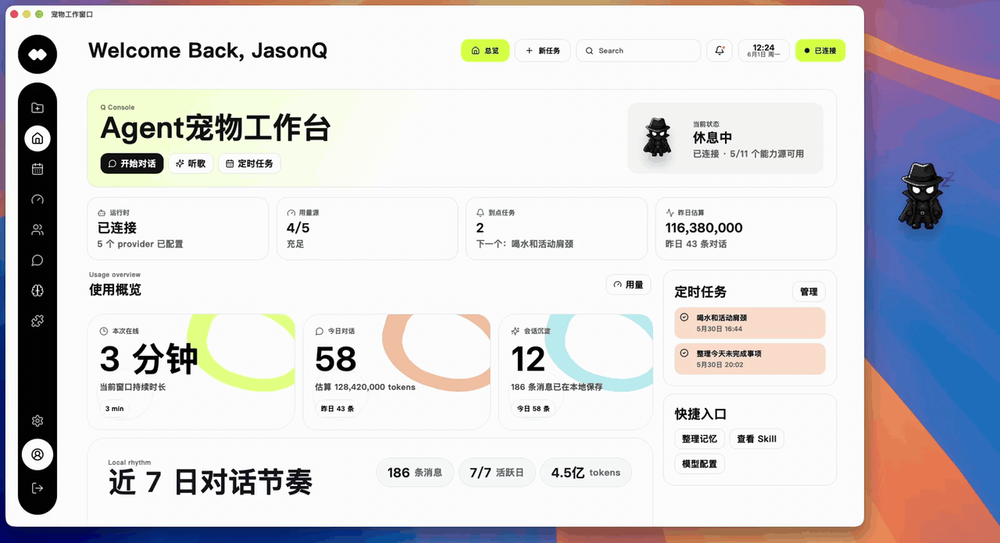
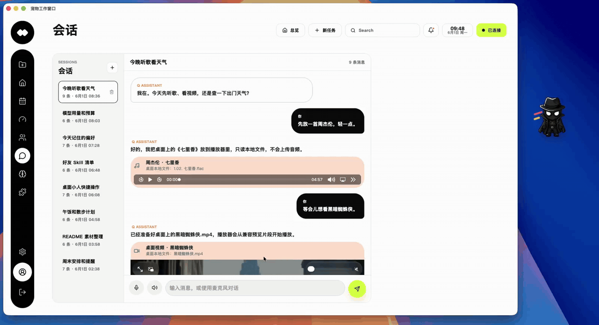
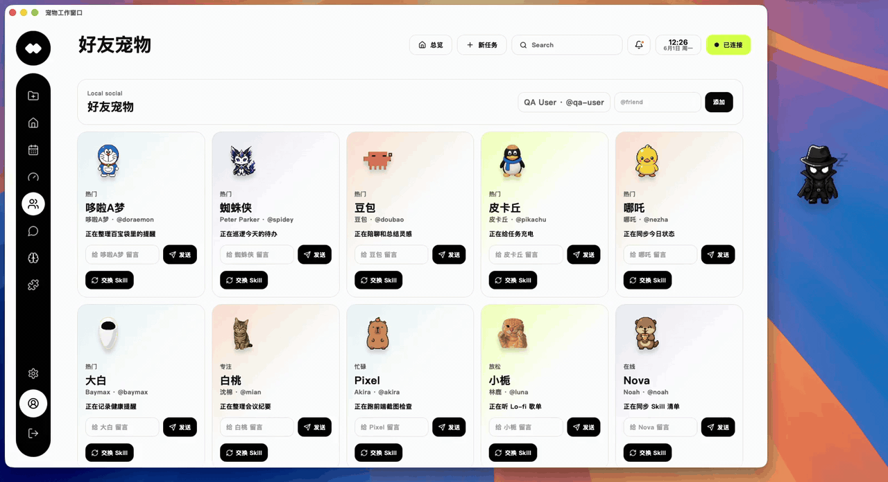
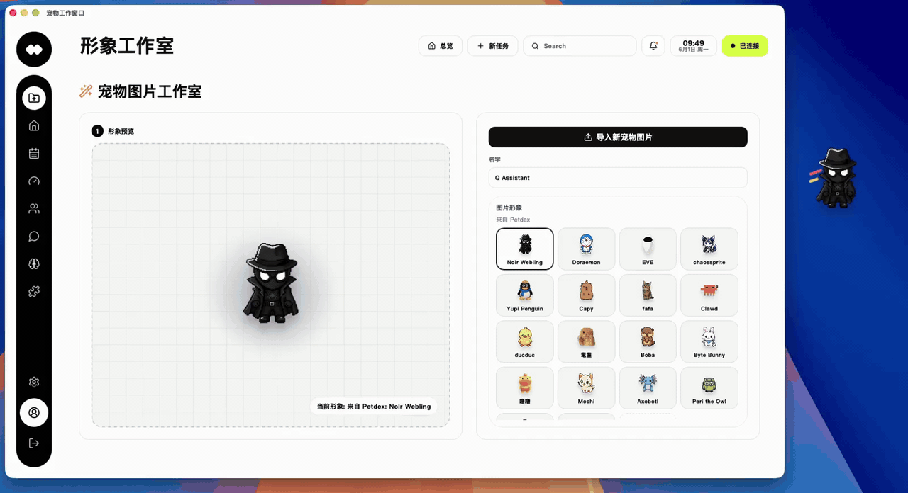
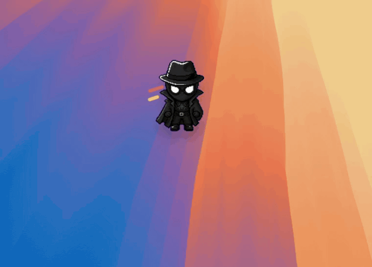

<p align="center">
  
</p>

<h1 align="center">🐾 Meow Pilot</h1>

<p align="center">
  <strong>把会工作、会记忆、会陪伴的AI宠物放进你的 Mac 桌面</strong>
</p>

<p align="center">
  
  
  
  
  
  
</p>

<p align="center">
  English · 中文
</p>

---

## 产品演示

<table>
<tr>
<td align="center" width="50%">



**主页、模型用量、记忆、skill、定时任务等**

</td>
<td align="center" width="50%">



**会话里内生成式UI卡片交互**

</td>
</tr>
<tr>
<td align="center">



**社交：与真实好友交换 Skill**

</td>
<td align="center">



**宠物造型选择与自定义生成**

</td>
</tr>
<tr>
<td align="center" colspan="2">



**宠物右键菜单快捷操作**

</td>
</tr>
</table>

---

## 覆盖场景

| 场景 | 体验 |
|:--|:--|
| **随手聊天** | 从桌面右键开始问，也可以展开多会话工作台继续聊 |
| **播放媒体** | 让宠物播放音乐或视频 |
| **生活卡片** | 天气、计划、提醒直接变成可看的小卡片 |
| **长期记忆** | 偏好、人设、日常事项可持续沉淀在本地 |
| **Skill 养成** | 从好友那里交换 Skill，让宠物越来越会帮忙 |
| **形象切换** | 预设角色和自定义图片都能变成桌面小人 |

---

## 快速开始

### 环境要求

- macOS（Tauri 桌面壳）
- Node.js ≥ 22
- pnpm ≥ 11
- Rust toolchain（Tauri 构建）

### 启动开发版

```bash
# 克隆并安装依赖
pnpm install

# 启动原生桌面 App（推荐）
pnpm --filter @pet/desktop tauri:dev

# 仅调试 Web UI + Agent Runtime
pnpm dev
```

启动后，一只透明置顶的桌面宠物会出现——点击它，打开工作窗口开始探索！

### 打包发布

```bash
# 构建 macOS .app
pnpm --filter @pet/desktop tauri:build

# 构建 DMG 安装包
pnpm --filter @pet/desktop tauri:build:dmg
```

产物路径：`apps/desktop/src-tauri/target/release/bundle/macos/Pet Agent.app`

---

## 配置

### 模型 API

推荐在 App 内「配置 → 模型 API」页面设置。也支持环境变量：

```bash
PET_AI_PROVIDER=openai          # deepseek / openai / anthropic / google / xai / openrouter
PET_AI_API_KEY=your-api-key
PET_AI_MODEL=gpt-4o-mini
PET_AI_BASE_URL=https://...     # 可选
```

<details>
<summary> 支持的 Provider 原生变量</summary>

```bash
OPENAI_API_KEY=...
ANTHROPIC_API_KEY=...
GOOGLE_GENERATIVE_AI_API_KEY=...
XAI_API_KEY=...
DEEPSEEK_API_KEY=...
OPENROUTER_API_KEY=...
OPENAI_COMPATIBLE_API_KEY=...
OPENAI_COMPATIBLE_BASE_URL=https://your-endpoint/v1
```
</details>

### 语音服务

推荐在 App 内「配置 → 语音模型」页面保存语音 API。也可以用环境变量接入已支持的语音服务，按你的服务商实际端点、模型和 voice 填写即可：

```bash
# 小米 MiMo / 兼容语音端点
XIAOMI_API_KEY=...
XIAOMI_BASE_URL=https://your-voice-endpoint/v1
XIAOMI_AUDIO_MODEL=...
XIAOMI_TTS_MODEL=...
XIAOMI_TTS_VOICE=...

# OpenAI 或兼容 OpenAI STT/TTS 协议的语音端点（可选）
PET_AI_TRANSCRIPTION_API_KEY=...
PET_AI_TRANSCRIPTION_BASE_URL=https://your-stt-endpoint/v1
PET_AI_TRANSCRIPTION_MODEL=...
PET_AI_SPEECH_API_KEY=...
PET_AI_SPEECH_BASE_URL=https://your-tts-endpoint/v1
PET_AI_SPEECH_MODEL=...
PET_AI_SPEECH_VOICE=...
```

---

## 项目架构

```
├── apps/desktop/              → React + Vite + Tauri 桌面应用
│   ├── src/features/          → 聊天、宠物、仪表盘、A2UI 组件
│   ├── src/services/          → WebSocket RPC 客户端
│   └── src-tauri/             → Rust 原生壳 & 窗口管理
├── packages/agent-runtime/    → Node.js WebSocket Agent 服务
│   ├── providers/             → AI SDK & 语音集成
│   └── storage.ts             → SQLite 本地持久化
├── packages/protocol/         → 前后端共享类型协议
└── skills/bundled/            → 内置技能定义
```

---

## 本地数据

所有数据完全本地存储，零云端依赖：

| 文件 | 说明 |
|:--|:--|
| `.pet/pet-agentd.sqlite` | 会话、消息、记忆、技能等全部数据 |
| `.pet/ai-provider.json` | 模型 API 配置 |

---
