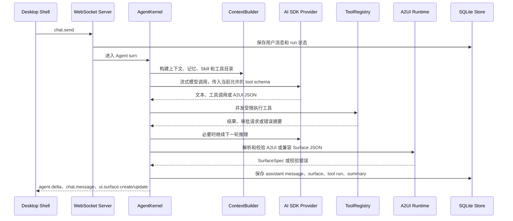

# Agent 编排与 A2UI 运行时

状态：当前实现说明
日期：2026-06-04

本文记录当前 Agent Runtime 的主流程、上下文策略、工具发现、A2UI 渲染和权限审计边界。README 只保留大纲，本文件承载实现级说明。

## 1. 运行时边界

- Desktop Shell 通过本地 WebSocket RPC 调用 `chat.send`、`session.*`、`memory.*`、`skill.*`、`permission.*` 等方法，并订阅 `agent.*`、`tool.*`、`ui.surface.*`、`pet.*` 事件。
- `server.ts` 是本地 RPC 入口，负责会话恢复、直出 Surface 快捷响应、任务调度事件、权限续行和事件广播。
- `AgentKernel` 负责一次主 Agent turn：上下文构建、可选计划、模型流式调用、工具循环、A2UI 解析修复、最终消息和 Surface 落盘。
- `ToolRegistry` 统一管理工具 schema、任务相关工具选择、`tool_search` 发现、权限请求、工具执行和审计记录。
- `MemoryService` 和 `SkillService` 只把当前任务需要的记忆、摘要和 Skill 候选放进上下文，避免全量加载。
- `providers/aiSdk.ts` 负责 AI SDK Provider 调用、系统提示、原生 tool calling、Provider fallback、超时和熔断。

## 2. 一次 chat.send 的主流程

核心规则：

- 简单问答可以跳过 Plan 和 Reflection，直接流式回答。
- 复杂任务才启用计划和反思，避免每次简单输入都产生额外模型调用。
- 同一 session 同时只允许一个主 run，权限中断会保存 continuation，用户审批后从中断点恢复。
- 工具结果回填会压缩和截断，避免多轮并行工具输出把消息上下文撑爆。

## 3. 工具发现与执行

工具不会全量暴露给模型。当前策略是：

1. `ContextBuilder` 先放入核心工具和任务相关工具类别。
2. `ToolRegistry.selectForUserText()` 根据用户文本选择少量默认工具。
3. 如果模型需要更多工具，先调用 `tool_search` 按类别或关键词发现。
4. 发现到的工具会合并进当前 run 的 allowed tool set，再作为 AI SDK 原生 tool schema 传给模型。

执行边界：

- 工具并发有全局上限，单个工具有超时保护。
- 只读 workspace 搜索、读取和低风险命令可以自动执行。
- 文件写入、删除、移动、patch、包管理器、sudo、上传、kill、外部网络和技能管理等操作需要用户确认。
- 每次工具运行写入 `tool_runs`，每次审批写入 `permissions_audit`，前端“工具与权限”页面展示待审批和运行时间线。

## 4. 记忆与 Skill 上下文

记忆策略：

- 会话窗口只保留近期消息和当前 run 的必要工具结果。
- 长会话通过 `session_summaries` 压缩，并在新增一定消息后刷新摘要。
- 长期记忆使用 SQLite FTS5 和本地 `memory_embeddings` 向量索引共同排序。
- 用户明确要求“记住”时可以写入长期记忆；其他来源优先生成提案或走工具确认。

Skill 策略：

- 启动时只扫描 `SKILL.md` frontmatter 和摘要，不把完整正文塞进 prompt。
- 当前任务先检索候选 Skill，再通过 `skill_view` 读取完整说明，或通过 `skill_run` 进入受控执行。
- Skill 不能绕过 ToolRegistry；脚本运行、文件修改、网络访问和技能管理都复用同一套权限链路。

## 5. A2UI 与 Surface 流程

A2UI 是模型驱动安全 UI 的协议层，前端实际渲染仍使用共享的 `SurfaceSpec`。

模型可以通过三种路径生成 UI：

- 调用 `surface_render` 或 `media_prepare` 这类结构化工具。
- 在 fenced `a2ui` JSON block 中输出 A2UI v0.10 envelope。
- 输出旧的 `pet-surface` 兼容 JSON，由 `surfaceProtocol.ts` 转成 `SurfaceSpec`。

A2UI envelope 当前支持：

- `createSurface`：声明 surface id、标题、意图、类型和 root component。
- `updateComponents`：增量提交受控组件和 actions。
- `updateDataModel`：按 JSON Pointer 更新 data model。
- `deleteSurface`：从 A2UI runtime state 中移除 surface。当前主渲染路径主要把 create/update materialize 为 `SurfaceSpec` 并推送前端事件。

Runtime 会先执行宿主校验：

- envelope 必须是 JSON 对象或数组。
- surface id、组件数量、action 数量、文本长度、表格行列和子节点数量有上限。
- 组件必须来自受控目录，例如 stack、text、list、table、timeline、form、metric-row、pie-chart、media-player。
- 不接受 React、Vue、HTML、CSS、JSX 或 TSX 作为 UI 实现。

如果校验失败：

1. `parseAgentSurfaceResponse()` 返回 validation errors，不渲染错误 UI。
2. `AgentKernel.repairA2UI()` 把错误反馈给模型，要求只返回修正后的 A2UI JSON。
3. 修复仍失败时，本轮保留文本回答，并提示 A2UI JSON 未通过宿主校验。

渲染和交互：

- 通过校验的 A2UI 会转换成 `SurfaceSpec`。
- Runtime 保存 surface，并发送 `ui.surface.create` 或 `ui.surface.update`。
- Desktop Shell 的 `SurfaceRenderer` 渲染受控组件。
- 用户点击按钮、提交表单或触发 surface action 时，会带 surface id 回到下一轮 `chat.send`，由 Agent 继续处理。

## 6. Provider 与可靠性

- 主模型调用走 AI SDK，工具调用使用 Provider 支持的原生 tool calling。
- Provider 配置按用户设置读取；未配置模型时返回明确提示，不进入无效 run。
- Provider fallback 是串行尝试，但每个 Provider 有调用超时。
- 连续失败的 Provider 会进入短期熔断窗口，冷却期内跳过，避免每次请求都卡在同一个慢失败 Provider 上。
- WebSocket 服务端有心跳，桌面客户端有重连逻辑，长时间 idle 后能更稳定地恢复。

## 7. 文档维护

- README：只写当前能力和大纲流程。
- `docs/agent-orchestration.md`：维护 Agent、工具、记忆、Skill、A2UI 和权限细节。
- `docs/architecture.md`：只做当前文档索引。
- `docs/archive/`：保留历史 review、todo、旧草案和修复清单，不作为当前实现依据。
