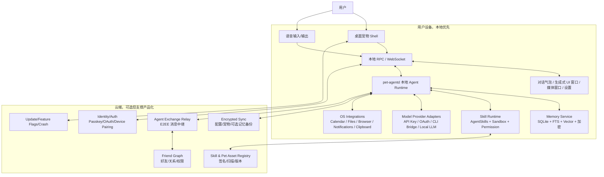
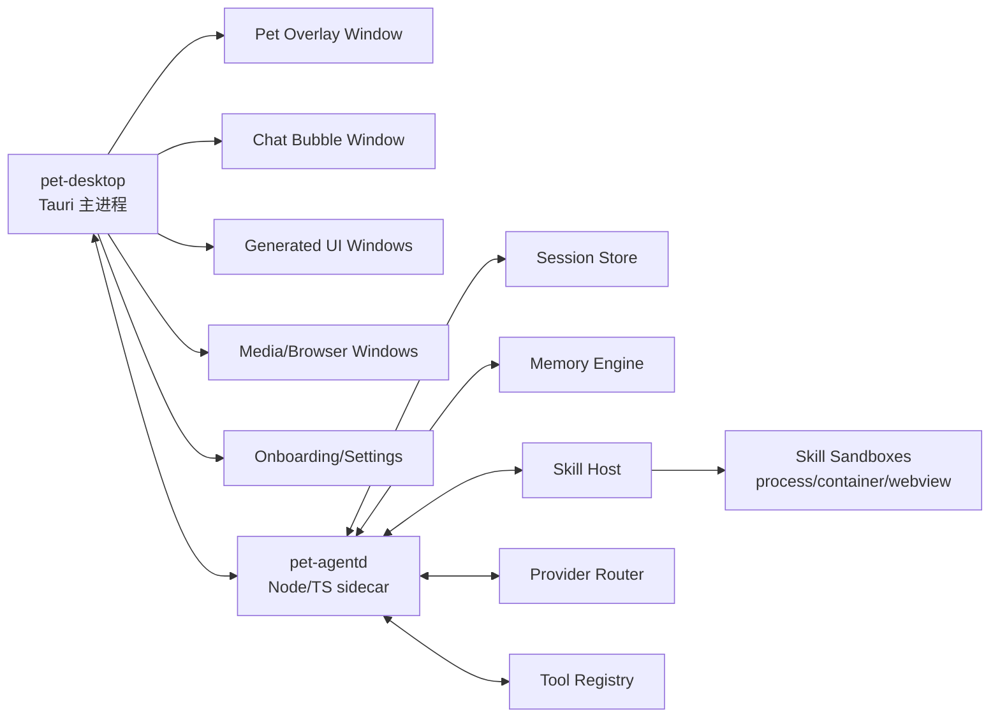
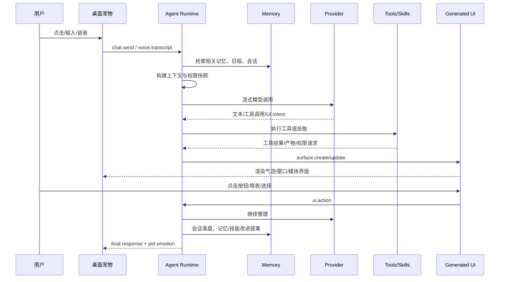
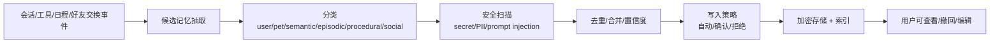

# 桌面宠物 Agent 系统架构设计

状态：Draft v0.1  
日期：2026-05-21  
目标：先形成可上线产品的总体架构，再拆 MVP 和工程任务。

## 1. 产品定位

这是一个 local-first 的桌面宠物 Agent。它不是普通聊天窗口，而是一个常驻桌面的拟人化代理入口：

- 平时以可定制宠物形态待在桌面上，点击后出现对话框。
- 支持文字、语音、唤醒/按住说话、打断和 TTS 播放。
- 回答不只输出文本，而是按任务生成可交互 UI：表格、表单、日程、搜索结果、播放器、视频窗口、文件预览、行动面板等。
- 支持 API Key，也支持通过本机已登录的 Codex / Claude Code 等官方 CLI 或 OAuth 桥接使用订阅能力。
- 支持从 Hermes / OpenClaw 迁移记忆、人格、技能、会话摘要和部分配置。
- 内置 AgentSkills 兼容技能系统，技能可安装、改进、授权、沙箱执行、分享。
- 有用户登录、好友系统。好友之间的宠物 Agent 可以在用户授权下交换当天日程摘要、做过的技能、技能经验、日常片段和可分享记忆。

产品原则：

1. **桌面优先**：第一入口是宠物和系统级快捷交互，不是网页后台。
2. **本地优先**：私密记忆、会话、技能和密钥默认留在本机；云端只做账号、同步、社交中继、市场和更新。
3. **生成式 UI 优先**：复杂结果进入可交互界面，纯文本只是兜底。
4. **可迁移、可退出**：数据用开放格式保存，迁移器可 dry-run，用户能导出。
5. **权限透明**：技能、工具、好友交换和云同步都有清晰的权限边界与审计日志。

## 2. 参考仓库结论

本设计参考了：

- OpenClaw：<https://github.com/openclaw/openclaw>，本地浅克隆 HEAD `e4272620`
- Hermes Agent：<https://github.com/NousResearch/hermes-agent>，本地浅克隆 HEAD `6c26727`

可吸收的设计：

- OpenClaw 的 Gateway 思路：单个本地长驻控制面，通过 WebSocket 连接桌面 App、Web UI、移动节点和自动化。
- OpenClaw 的 Canvas/A2UI 思路：Agent 可以驱动一个安全 UI surface，而不是只发消息。
- OpenClaw 的 Talk 模式：本地 STT/TTS、实时语音、打断、不同 voice provider 的分层。
- OpenClaw 的技能优先级：workspace、项目、个人、托管、本地、内置、额外目录，多来源可覆盖。
- Hermes 的 Agent loop：入口多样，但核心 Agent 循环统一，负责 prompt、provider、tool、session、compression、persistence。
- Hermes 的记忆：短小常驻记忆 + 用户画像 + SQLite/FTS 会话搜索 + 外部记忆 provider。
- Hermes 的技能：AgentSkills 兼容、渐进加载、`SKILL.md`、技能目录结构、技能可被 Agent 管理。
- Hermes 的 OpenClaw 迁移：先 dry-run，导入人格、记忆、技能、API key 白名单、TTS 资产和工作区指令。

不直接照搬的点：

- OpenClaw/Hermes 都是“多通道 Agent 网关”优先，本产品是“桌面宠物产品体验”优先。
- 不能让远程聊天输入默认拥有桌面高权限；好友 Agent 交换必须被降权、摘要化、可撤销。
- 生成式 UI 不能默认运行任意 HTML/JS。默认使用声明式 UI DSL，只有用户授权的技能才能打开沙箱 WebView。

## 3. 总体架构



核心拆分：

- **桌面 Shell**：负责宠物窗口、透明置顶、拖拽、点击、气泡、生成式 UI 容器、媒体窗口、系统权限。
- **本地 Agent Runtime**：负责 Agent loop、模型路由、上下文、工具、技能、记忆、会话、事件流。
- **云端控制面**：负责登录、好友、设备、交换中继、技能/素材市场、同步和更新，不默认持有用户原始记忆。
- **协议层**：桌面与 Agent Runtime、Agent Runtime 与云端都走 typed event/RPC，保证以后可替换 UI shell 或 agent kernel。

## 4. 技术栈建议

推荐首选：

| 层 | 推荐 | 原因 |
| --- | --- | --- |
| 桌面壳 | Tauri 2 + Rust | 体积小、原生能力强、适合透明置顶窗口、系统托盘、权限和签名发布 |
| UI | React + TypeScript + Vite | 适合复杂生成式 UI、状态管理和跨窗口组件复用 |
| 本地 Agent Runtime | Node.js 22/24 + TypeScript sidecar | 模型 SDK、MCP、工具生态和流式事件实现快 |
| 高风险工具/技能 | 隔离子进程，必要时 Docker/Firecracker/平台 sandbox | 避免技能直接污染主进程 |
| 本地数据 | SQLite + FTS5 + sqlite-vec/LanceDB + SQLCipher | 离线、可迁移、可全文检索和语义检索 |
| 云端 API | TypeScript/NestJS 或 Go | 团队按熟悉度选；都能支撑 WebSocket、队列和高并发 |
| 云端数据 | Postgres + Redis + Object Storage | 账号、好友、同步元数据、技能包、素材和事件队列 |
| 实时交换 | WebSocket 起步，WebRTC DataChannel 后续 | MVP 先可靠中继，后续可做端到端直连 |
| 更新发布 | Tauri updater + 代码签名/公证 | 产品化发布必须具备 |

保留 Electron 备选：如果 Tauri 在某个平台的透明置顶窗口、WebView 媒体能力或 Live2D/Spine 性能遇到硬阻塞，可以保留同一套 `pet-agentd` 协议，用 Electron 实现桌面壳。协议先行可以降低换壳成本。

## 5. 本地进程架构



进程职责：

- `pet-desktop`：生命周期、窗口、权限、系统集成、自动更新、Keychain 访问、音频设备、通知。
- `pet-agentd`：Agent loop、provider adapter、tool dispatch、memory、skill、generated UI planner、cloud sync client。
- `skill-sandbox-*`：按权限启动的隔离技能执行环境。每次运行有 session id、权限快照、资源限制和审计日志。

本地 RPC：

- 传输：loopback WebSocket 或 Tauri IPC，初期 WebSocket 更利于调试和复用 Web UI。
- 首帧握手：设备 id、session token、协议版本、capabilities。
- 消息模型：`req/res/event`，所有 side effect 必须带 idempotency key。
- 事件流：agent delta、tool start/end、ui surface update、voice state、memory write proposal、permission request。

## 6. Agent Runtime 模块

### 6.1 Agent Kernel

统一处理所有入口：宠物点击输入、语音、快捷键、生成式 UI action、cron、好友 Agent 交换。

核心模块：

- `SessionManager`：会话、分支、压缩、消息落盘、FTS 索引。
- `ContextBuilder`：人格、用户画像、当前宠物状态、短期会话、相关记忆、技能摘要、日程摘要。
- `ProviderRouter`：OpenAI、Anthropic、OpenRouter、本地模型、Codex CLI、Claude Code CLI 等。
- `ToolRouter`：工具 schema、权限、审批、执行、结果裁剪。
- `PolicyEngine`：本地/远程输入权限、好友交换权限、危险操作审批。
- `UIPlanner`：把模型输出的 UI intent 转成声明式 surface。
- `LearningLoop`：任务结束后提取经验、提出记忆写入、技能改进或新技能建议。

### 6.2 Provider Adapter

支持两类模式：

1. **API 模式**：用户配置 OpenAI/Anthropic/OpenRouter/兼容 OpenAI endpoint 等 API key。
2. **本机登录桥接模式**：用户已登录 Codex CLI、Claude Code CLI 等官方工具时，通过本机 CLI 子进程或官方协议调用，不收集密码、不抓取浏览器 cookie。

Provider 能力抽象：

```ts
type ProviderCapabilities = {
  text: boolean;
  vision: boolean;
  audioIn: boolean;
  audioOut: boolean;
  realtime: boolean;
  toolCalling: boolean;
  jsonSchema: boolean;
  maxContextTokens: number;
};
```

路由策略：

- 默认模型用于主对话。
- 快速模型用于 UI 修补、搜索摘要、记忆抽取。
- 视觉/音频模型按任务临时调用。
- 如果使用 CLI bridge，必须将文件、命令和工具权限降到当前 session 范围内。

## 7. 对话与任务生命周期



关键点：

- 一个 session 同时只允许一个主 Agent turn，避免工具和记忆竞态。
- UI action 进入同一个 turn 或派生 child turn，必须带来源 surface id。
- 记忆写入默认是“提案 -> 自动低风险写入或用户确认”，避免被 prompt injection 污染。
- 每个工具和技能执行都记录审计事件，供用户回看“宠物刚才做了什么”。

## 8. 生成式 UI 架构

### 8.1 Surface 类型

- `bubble`：宠物旁的轻量聊天气泡。
- `panel`：查询结果、日程、任务、设置等中型面板。
- `media`：音乐、视频、播客、网页播放器。
- `modal`：授权、确认、付款、危险操作审批。
- `canvas`：长任务工作台，如调研、表格、看板、计划。
- `mini-widget`：倒计时、播放控制、会议提醒等小浮窗。

### 8.2 声明式 UI DSL

默认不让模型生成任意 HTML/JS，而是生成受控 schema：

```ts
type SurfaceSpec = {
  id: string;
  type: "bubble" | "panel" | "media" | "modal" | "canvas" | "mini-widget";
  title?: string;
  layout: ComponentNode;
  data?: Record<string, unknown>;
  actions?: UIAction[];
  permissions?: PermissionRequest[];
  expiresAt?: string;
};
```

组件库第一批：

- 文本、Markdown、代码块、引用、分割线。
- 表格、列表、卡片、详情页、筛选器、排序器、分页。
- 表单、输入框、选择器、日期/时间、文件选择。
- 日历、时间线、待办、看板。
- 搜索结果、来源卡、引用查看。
- 音频播放器、视频播放器、播放队列、歌词/字幕。
- 地图、路线、天气、价格比较。
- 图表：折线、柱状、饼图、散点、进度。
- 操作按钮、菜单、确认框、权限提示。

### 8.3 Rich UI 沙箱

少数高级技能可以提供自定义 HTML/JS bundle，例如复杂编辑器、游戏、可视化、第三方 SDK。要求：

- 技能 manifest 声明 `ui.sandbox: true`。
- CSP 默认禁止远程脚本，网络域名白名单。
- 文件系统、剪贴板、麦克风、摄像头、屏幕录制都必须显式授权。
- 与 Agent 只通过 `postMessage` 的 typed bridge 通信。
- UI bundle 进入技能市场前要静态扫描、签名和版本锁定。

## 9. 桌面宠物体验层

宠物系统模块：

- `PetRenderer`：Live2D / Rive / Spine / sprite sheet / 3D 模型适配。
- `PetStateMachine`：idle、thinking、listening、speaking、happy、confused、busy、sleeping。
- `InteractionLayer`：点击、拖拽、右键菜单、快捷键、边缘吸附、穿透模式。
- `PersonaBinding`：宠物外观、名字、人格、声音、口头禅、动作风格。
- `NotificationBridge`：会议提醒、好友宠物来访、任务完成、技能建议。

初始化定制：

1. 选择宠物基础形态或导入素材。
2. 选择名字、称呼方式、说话风格、声音。
3. 选择常用模型/provider。
4. 导入 Hermes/OpenClaw 数据或从零开始。
5. 配置隐私级别：纯本地、登录同步、好友社交。

### 9.1 图片形象生成与拆件确认

首版采用主流 2D 桌面角色常见的分层 rig 路线，而不是把原图直接替换成不可编辑位图：

1. 用户从本地导入 JPG / PNG / WebP，原始素材不上传。
2. 前端在 Canvas 中归一化图片尺寸，对普通照片执行用户可调的边缘颜色去背；已有 alpha 的透明 PNG 直接保留透明边缘。
3. 生成 `head`、`body`、`feet` 三张透明 PNG 拆件，并提供照片、贴纸轮廓、像素三种展示样式。
4. 用户确认前可以调整去背阈值、整体缩放/构图位置、层边界、头部偏移和动作性格，并可下载拆件检查。
5. 确认后只把轻量 asset id 写入宠物配置，原图与拆件保存到本机 IndexedDB；`PetStateMachine` 继续驱动自定义图层动画，用户可一键删除导入素材和全部拆件。

此形态对应 Live2D/Spine 的分层与枢轴思路，也兼容 sprite 型桌面宠物的状态切换。复杂背景语义抠图、骨骼点自动识别和模型风格迁移应作为可选 image provider 接入，必须在上传用户图片前展示权限和隐私说明。

### 9.2 活动状态看板

工作台中的宠物不再只展示表情，而是进入由状态事件驱动的场景舞台：

1. runtime 在任务开始时发布 `pet.activity`；搜索、查阅文档和调研意图进入 `research`，其余执行型任务进入 `coding`。
2. `coding` 场景渲染电脑、滚动代码光标与咖啡蒸汽；`research` 场景以在卫生间刷手机查资料的幽默方式表现信息检索。
3. 任务完成后 runtime 发布空闲活动，前端在 `exercise` 与 `sleeping` 间轮换，提供哑铃、瑜伽垫、床铺和睡眠气泡动画。
4. 所有场景内都使用同一 `PetAvatar` 渲染边界，因此基础形态和用户确认过的图片拆件均能自然复用；手动预览不会更改任务状态，下一次真实事件会恢复自动显示。

宠物状态来自 Agent event，而不是 UI 猜测。例如：

```ts
type PetEmotionEvent = {
  kind: "pet.emotion";
  sessionId: string;
  emotion: "idle" | "listening" | "thinking" | "speaking" | "celebrating" | "needs_attention";
  intensity: number;
  reason?: string;
};

type PetActivityEvent = {
  sessionId: string;
  activity: "coding" | "research" | "exercise" | "sleeping";
  active: boolean;
  reason?: string;
};
```

## 10. 语音与媒体

语音输入：

- MVP：按住说话 + VAD 自动断句。
- 后续：唤醒词、连续对话、实时模型、打断。
- STT provider：系统语音、Whisper local、OpenAI/Deepgram/兼容接口。

语音输出：

- 系统 TTS 兜底。
- 可配置 OpenAI/ElevenLabs/本地 TTS。
- 宠物语音与人格绑定，可按情绪切 voice/style。
- 支持播放中打断，打断信息进入下一轮上下文。

媒体窗口：

- 音乐：Spotify/Apple Music/YouTube Music/本地文件，按 skill/provider 能力启用。
- 视频：YouTube/Bilibili/本地文件/网页，优先打开独立 media surface。
- 媒体控制以 UI action 进入 Agent，不让模型直接操控用户账号高危操作。

## 11. 记忆系统

### 11.1 分层记忆

| 层 | 用途 | 默认位置 |
| --- | --- | --- |
| 用户画像 | 用户偏好、称呼、工作习惯、沟通风格 | 本地加密 DB，少量进入 prompt |
| 宠物自我记忆 | 宠物人格、承诺、学到的环境事实 | 本地加密 DB，少量进入 prompt |
| 语义记忆 | 长期事实、项目、关系、偏好 | 本地 DB + FTS/vector |
| 情节记忆 | 每次会话/一天的摘要、事件线 | 本地 DB，可搜索 |
| 程序记忆 | 可复用流程、技能、工具经验 | Skills + skill usage logs |
| 社交记忆 | 好友宠物分享的摘要卡 | 独立 scope，默认不混入私密记忆 |
| 原始会话 | 完整消息、工具事件、UI action | 本地 DB，用户可清理/导出 |

### 11.2 记忆写入流程



记忆规则：

- prompt 中只放小而稳定的 profile/memory card。
- 细节通过 FTS/vector 按需检索。
- 日程、好友交换、网页内容等外部输入默认标记为 untrusted，不能直接写入高置信用户画像。
- 记忆有 `source`、`confidence`、`scope`、`visibility`、`expires_at`。
- 社交分享的内容进入 `social` scope，除非用户明确“采纳到我的记忆”。

本地核心表草案：

```sql
memories(
  id text primary key,
  owner_user_id text not null,
  pet_id text not null,
  scope text not null,          -- private | social | shared | system
  kind text not null,           -- user_profile | pet_note | semantic | episodic | procedural
  content text not null,
  summary text,
  source_type text not null,    -- chat | tool | calendar | import | friend | skill
  source_id text,
  confidence real not null,
  visibility text not null,     -- local_only | sync_encrypted | shareable
  pii_tags text,
  created_at text not null,
  updated_at text not null,
  expires_at text
);
```

### 11.3 Hermes/OpenClaw 迁移

迁移器命令建议：

```bash
pet migrate scan
pet migrate openclaw --dry-run
pet migrate hermes --dry-run
pet migrate openclaw --preset user-data
pet migrate hermes --include sessions,skills,memories
```

导入映射：

| 来源 | 目标 |
| --- | --- |
| `SOUL.md` / personality | 宠物人格草案，需用户确认 |
| `USER.md` | 用户画像候选 |
| `MEMORY.md` | 语义记忆候选 |
| SQLite session / transcript | 原始会话 + 情节摘要 + FTS |
| `skills/*/SKILL.md` | 本地技能，保留 provenance |
| gateway/platform config | 连接器建议，不默认启用 |
| API keys | 只导入白名单 provider，写入系统 Keychain，必须确认 |
| TTS/audio assets | 宠物声音/素材候选 |
| AGENTS.md / workspace context | 项目上下文或技能参考，不直接混入用户画像 |

迁移必须支持：

- dry-run 报告：数量、冲突、风险、密钥、技能权限。
- 去重：同一记忆来源、相似内容、相同技能 slug。
- 回滚：每次迁移创建 batch id，可以整体撤销。
- 隐私：默认不上传迁移数据到云端。

## 12. 技能系统

采用 AgentSkills 兼容目录结构：

```text
skills/
  productivity/calendar-brief/
    SKILL.md
    scripts/
    templates/
    references/
    assets/
```

技能来源优先级：

1. 当前工作区技能：`<workspace>/skills`
2. 项目 Agent 技能：`<workspace>/.agents/skills`
3. 用户个人技能：`~/.agents/skills`
4. 本产品托管技能：`~/Library/Application Support/Pet/skills`
5. 内置技能
6. 好友分享/市场技能，安装后进入托管技能目录

技能 manifest 扩展：

```yaml
---
name: calendar-brief
description: Summarize calendar and create daily brief UI.
version: 1.0.0
permissions:
  calendar: read
  network:
    - api.example.com
ui:
  surfaces:
    - panel
    - mini-widget
runtime:
  sandbox: process
  timeout_ms: 120000
sharing:
  shareable: true
  contains_secrets: false
---
```

技能生命周期：

- discover：只加载 name/description/permissions 摘要。
- view：需要时加载完整 `SKILL.md`。
- run：按权限快照执行脚本/工具。
- observe：记录成功率、耗时、用户反馈、常见错误。
- improve：Agent 可提出 patch，但高风险技能修改需确认。
- package：签名、扫描、生成 provenance。
- share：好友交换时发送 `SkillCard`，不是直接远程执行。

好友技能交换安全策略：

- 收到技能只进入 quarantine。
- 展示 diff、权限、来源、签名、扫描结果。
- 用户确认后安装。
- 默认禁用自动更新；市场/好友技能更新都要版本说明。

## 13. 登录、好友与宠物互学

### 13.1 账号与设备

账号系统：

- 登录方式：Passkey、邮箱 magic link、GitHub/Google/Apple OAuth。
- 每台设备有 device key pair。
- 本地 Agent 与云端通信使用短期 token，refresh token 存 Keychain。
- 宠物是账号下的实体：`pet_id`、外观、人格、模型偏好、技能目录、同步策略。

### 13.2 好友添加

方式：

- 分享链接。
- 二维码。
- 用户名/邀请码。
- 近场局域网可后续支持。

好友关系有 scope：

- `presence`：在线/忙碌/宠物状态。
- `daily_digest`：当天摘要。
- `schedule_summary`：日程摘要，不含原始标题细节可选。
- `skill_cards`：技能目录和经验。
- `agent_message`：宠物间可互发消息。
- `joint_task`：允许共同执行低风险任务。

### 13.3 Agent 交换协议

默认通过云端 Relay 中继，内容端到端加密：

```ts
type AgentExchangeEnvelope = {
  id: string;
  fromPetId: string;
  toPetId: string;
  type:
    | "owner_day_digest"
    | "schedule_summary"
    | "skill_card"
    | "experience_card"
    | "memory_card"
    | "joint_task_request"
    | "presence";
  consentScope: string;
  createdAt: string;
  ttlSeconds: number;
  ciphertext: string;
  signature: string;
};
```

交换内容原则：

- 分享摘要，不分享原始会话。
- 分享“技能经验”优先于“技能代码”。
- 好友宠物不能直接写入本地私密记忆，只能创建 social memory proposal。
- 宠物可以互相学习“主人今天大概忙什么、做了什么技能、有哪些经验”，但必须受用户设定限制。
- 任何跨用户 joint task 都必须有双方可见的任务卡和撤销按钮。

日程学习示例：

1. 本地 Calendar connector 读取用户日程。
2. Agent 生成 `schedule_summary`，如“上午有两场会议，下午专注写代码，晚上可能有空”。
3. 按好友 scope 发送摘要。
4. 对方宠物只看到摘要，用于安排互动或避免打扰。
5. 原始日程标题、地点、参会人默认不分享。

## 14. 云端服务架构

服务边界：

| 服务 | 职责 |
| --- | --- |
| Identity Service | 用户、设备、公钥、登录、token |
| Pet Profile Service | 宠物配置、外观元数据、同步策略 |
| Friend Graph Service | 好友关系、权限 scope、拉黑/撤销 |
| Relay Service | Agent exchange envelope 中继、队列、推送 |
| Sync Service | 端到端加密配置/技能索引/可选记忆备份 |
| Skill Registry | 技能市场、签名、扫描、版本、下载 |
| Asset Registry | 宠物素材、声音包、主题 |
| Update Service | 桌面版本、灰度、强制更新、公告 |
| Observability | 崩溃、匿名性能指标、敏感信息脱敏后的 action 日志 |

云端不默认存储：

- 原始聊天内容。
- 原始私密记忆。
- 明文 API key。
- 未经用户授权的日程详情。

## 15. API 草案

### 15.1 本地 RPC

| 方法 | 方向 | 用途 |
| --- | --- | --- |
| `session.create` | UI -> Agent | 创建会话 |
| `chat.send` | UI -> Agent | 发送文本或 UI action |
| `voice.transcript` | UI -> Agent | 发送语音转写 |
| `agent.cancel` | UI -> Agent | 取消当前 turn |
| `ui.surface.create/update/delete` | Agent -> UI | 生成式 UI |
| `ui.action` | UI -> Agent | 用户点击/输入回传 |
| `memory.query/propose/commit/reject` | UI <-> Agent | 记忆查看与确认 |
| `skill.list/view/install/run` | UI <-> Agent | 技能管理 |
| `provider.list/configure/test` | UI <-> Agent | 模型配置 |
| `permission.request/resolve` | Agent <-> UI | 权限审批 |
| `pet.emotion/set_pose` | Agent -> UI | 宠物状态 |

### 15.2 云端 API

| API | 用途 |
| --- | --- |
| `POST /auth/login/*` | 登录 |
| `POST /devices/pair` | 设备配对 |
| `GET /friends` / `POST /friends/invite` | 好友 |
| `PATCH /friends/:id/scopes` | 权限 scope |
| `WS /relay` | Agent exchange |
| `GET /skills` / `GET /skills/:slug` | 技能市场 |
| `POST /sync/push` / `GET /sync/pull` | 加密同步 |
| `GET /updates/:platform` | 自动更新 |

## 16. 安全与隐私

威胁模型重点：

- 网页、搜索结果、好友消息、日程邀请都可能包含 prompt injection。
- 第三方技能可能包含恶意脚本。
- 模型可能试图越权读取文件、密钥、日程、社交数据。
- 好友宠物交换可能泄露私密生活信息。
- 本机 CLI bridge 可能扩大 Codex/Claude 的权限边界。

安全策略：

- 密钥只存 OS Keychain / Credential Manager，不进入 prompt，不写日志。
- 工具按权限分级：read-only、confirm、dangerous、forbidden。
- 远程输入默认没有桌面工具权限。
- 技能安装前扫描，运行时沙箱，网络/文件/进程权限显式声明。
- 生成式 UI 默认声明式 schema；自定义 WebView 必须 CSP + domain allowlist。
- 记忆写入前做 secret/PII/prompt-injection 扫描。
- 社交交换默认摘要化、端到端加密、TTL、可撤销。
- 每个工具调用、记忆写入、好友交换都进入审计日志。
- 用户可以一键进入“隐私模式”：暂停云同步、好友交换、屏幕/麦克风、主动记忆。

## 17. 数据模型草案

本地核心表：

- `users_local`：本机用户映射、登录状态。
- `pets`：宠物实例、外观、人格、声音、状态。
- `sessions`：会话元数据、入口、模型、状态。
- `messages`：文本、工具事件、UI action、附件引用。
- `ui_surfaces`：生成式 UI spec、状态、来源 turn。
- `memories`：分层记忆。
- `memory_links`：记忆与 session/message/tool 的来源关系。
- `skills`：技能安装、路径、版本、来源、签名。
- `skill_runs`：技能执行记录、结果、错误、反馈。
- `providers`：provider 配置元数据，不含明文密钥。
- `permissions_audit`：权限请求和用户决策。
- `exchange_inbox`：好友宠物交换 envelope、解密状态、采纳状态。

云端核心表：

- `users`
- `devices`
- `pets`
- `friendships`
- `friend_scopes`
- `relay_messages`
- `skill_packages`
- `asset_packages`
- `sync_blobs`
- `feature_flags`
- `crash_reports`

## 18. 工程仓库结构建议

```text
Pet/
  apps/
    desktop/              # Tauri + React 桌面应用
    web-admin/            # 可选 Web 管理/市场后台
  packages/
    agent-runtime/        # pet-agentd，Agent loop/provider/tool/memory
    ui-runtime/           # 生成式 UI DSL、renderer、component schema
    protocol/             # 本地 RPC 与云端 exchange 类型
    skill-sdk/            # 技能开发、打包、签名、测试
    pet-renderer/         # Live2D/Rive/Spine/sprite 适配
  services/
    api/                  # Auth/Profile/Friend/Sync API
    relay/                # Agent exchange WebSocket
    registry/             # 技能/素材市场
  skills/
    bundled/              # 内置技能
  docs/
    architecture.md
    adr/
  scripts/
    migrate/
    release/
```

## 19. MVP 分期

### P0：架构与原型验证

交付：

- Tauri 透明宠物窗口 PoC。
- 本地 `pet-agentd` WebSocket PoC。
- 生成式 UI schema -> React renderer PoC。
- SQLite 记忆/会话最小模型。
- Provider adapter 打通一个 API provider 和一个 CLI bridge。

验收：

- 点击宠物能聊天。
- Agent 能创建一个可交互 panel。
- 关闭 App 后会话和一条记忆能恢复。

### P1：本地桌面宠物 MVP

交付：

- 宠物初始化定制。
- 文本对话、模型配置、Keychain 密钥存储。
- 对话气泡、panel、modal 三类 surface。
- 记忆提案/确认/搜索。
- AgentSkills 兼容技能 list/view/run。
- 审计日志和基础权限弹窗。

验收：

- 用户可以不用云端账号完成本地体验。
- 至少 5 个内置技能：网页查询、日程摘要、音乐搜索、视频搜索、待办/提醒。

### P2：语音、媒体与迁移

交付：

- 按住说话、STT、TTS、打断。
- media surface：音乐/视频播放控制。
- Hermes/OpenClaw 迁移器 dry-run + import。
- 技能安装/禁用/权限查看。

验收：

- 能从 Hermes/OpenClaw 导入记忆和技能，且可撤销。
- “我想听歌/看视频/查资料”会弹出对应可交互 UI。

### P3：账号、同步、好友

交付：

- 登录、设备配对、宠物配置云同步。
- 好友添加、scope 管理。
- Agent exchange relay。
- 日程摘要、技能卡、经验卡交换。

验收：

- 两个用户互加好友后，宠物可以交换当天摘要和技能经验。
- 任何分享都能在权限面板撤销。

### P4：产品化 Beta

交付：

- 自动更新、签名、公证、崩溃上报。
- 技能市场初版、扫描、签名、版本。
- 更完整的 sandbox。
- 数据导出/删除、隐私模式、合规文档。
- 性能优化：冷启动、内存占用、语音延迟。

验收：

- macOS 可外部分发；Windows/Linux 进入灰度。
- 本地核心功能离线可用。

## 20. 关键风险与应对

| 风险 | 应对 |
| --- | --- |
| 透明置顶宠物跨平台细节多 | 先 macOS 打磨，协议保持 shell 可替换 |
| 生成式 UI 失控或不安全 | 默认 DSL，任意 WebView 只给受信技能 |
| 记忆被污染 | 写入提案、安全扫描、source/confidence/scope、用户可撤销 |
| 好友交换泄露隐私 | 摘要化、scope、E2EE、TTL、审计、默认关闭敏感字段 |
| CLI bridge 权限过大 | 子进程隔离、工作区限制、工具权限镜像、日志可见 |
| 技能市场供应链 | 签名、扫描、quarantine、权限 manifest、版本锁 |
| 云端成本和合规 | 云端不存明文私密数据，先做 relay/sync metadata |

## 21. 下一步工程任务

1. 建立 monorepo 基础：`apps/desktop`、`packages/protocol`、`packages/agent-runtime`。
2. 定义本地 RPC schema 和 `SurfaceSpec` JSON schema。
3. 做 Tauri 宠物透明窗口 + React 生成式 UI renderer PoC。
4. 做 `pet-agentd` 最小 Agent loop：chat -> provider -> stream -> surface event。
5. 做本地 SQLite schema migration。
6. 写 Hermes/OpenClaw 迁移器扫描器，只做 dry-run 报告。
7. 设计第一批内置技能 manifest。

## 22. 待确认问题

- 首发平台：只做 macOS，还是 macOS + Windows 同步推进？
- 宠物渲染格式：Live2D、Rive、Spine、sprite sheet，还是先用轻量 sprite？
- “直接 Codex/Claude 登录”优先支持哪些官方入口：Codex CLI、Claude Code CLI、OAuth，还是都做？
- 好友系统首版是否需要移动端通知，还是桌面在线中继即可？
- 技能市场是否一开始开放第三方上传，还是先只支持官方/本地/好友分享？
