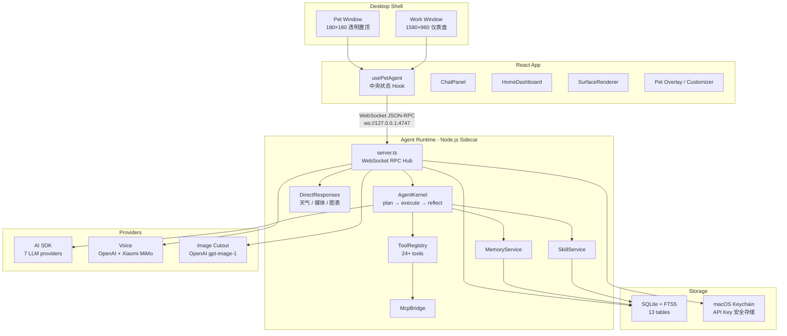
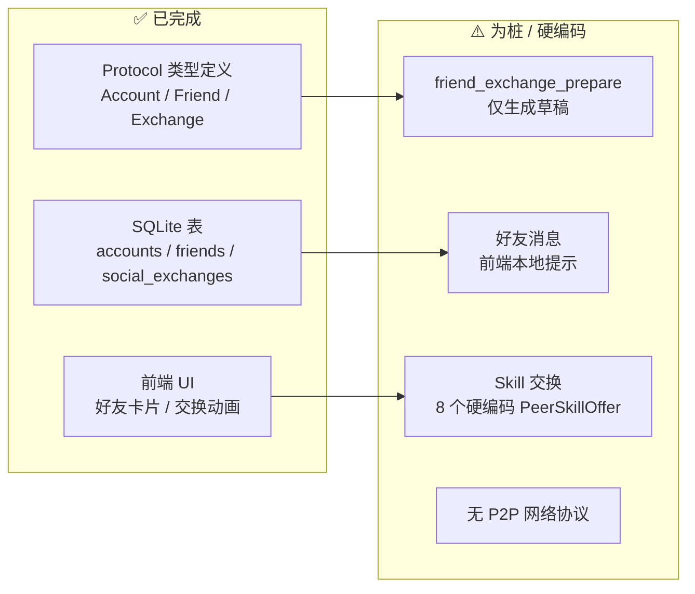

# 🐾 Meow Pilot — 架构 Review 报告

> **Review 范围**：Protocol · Agent Runtime · Desktop App · Skills · 基础设施
> **Review 日期**：2026-06-04

---

## 一、架构总览



---

## 二、各层功能完成度矩阵

### 2.1 Protocol 层 (`@pet/protocol`)

| 模块 | 方法数/事件数 | 完成度 | 评价 |
|------|-------------|--------|------|
| Session 管理 | 5 methods | ✅ 完善 | create / list / resume / delete / hello 齐全 |
| Chat 通信 | 1 method + streaming | ✅ 完善 | 支持 text/voice/ui 来源, attachments |
| Voice 语音 | 3 methods | ✅ 完善 | transcribe / speak / configure |
| Memory 记忆 | 5 methods | ✅ 完善 | list / query / propose / commit / reject 全链路 |
| Skill 技能 | 5 methods | ✅ 完善 | list / search / view / run / manage |
| Tool 工具 | 3 methods | ✅ 完善 | catalog / invoke / audit.list |
| Permission 权限 | 2 methods | ✅ 完善 | list / resolve |
| Social 社交 | 5 methods | ⚠️ 协议完备但实现为桩 | account / friend / exchange |
| Pet 宠物 | 事件 + cutout | ✅ 完善 | emotion / activity 事件 + 图像处理 |
| UI Surface | 3 events | ✅ 完善 | create / update / delete，10 种组件类型 |
| Provider 配置 | 2 methods | ✅ 完善 | configure / list |
| Usage 用量 | 1 method | ✅ 完善 | 5 平台的用量追踪 |

> [!TIP]
> Protocol 类型设计扎实——35 个 RPC 方法、11 个事件、完整的 discriminated union + runtime type guard，是项目最成熟的一层。

---

### 2.2 Agent Runtime（核心引擎）

#### Agent Kernel

| 能力 | 状态 | 说明 |
|------|------|------|
| Plan → Execute → Reflect 循环 | ✅ 完善 | 最多 5 轮工具调用，LLM 质量反思 |
| 权限中断 + 续行 (Continuation) | ✅ 完善 | 序列化 Continuation，用户审批后恢复 |
| ContextBuilder 上下文预算 | ✅ 完善 | 24k token 预算，按比例分配 history/memory/skills |
| 显式记忆提取 ("记住:…") | ✅ 完善 | 自动从用户消息中提取 |
| Sub-agent 研究 / 代码 | ⚠️ 有限 | 子 Agent 无工具访问，只能推理不能执行 |
| 流式输出 (streaming) | ✅ 完善 | agent.delta 事件实时推送 |

#### 工具体系 (24+ tools)

| 分类 | 工具 | 状态 |
|------|------|------|
| 终端 | `terminal_exec` | ✅ 完善（安全命令自动审批，危险命令确认） |
| 文件 | `file_search` / `file_list` / `file_read` / `file_write` / `file_patch` / `file_delete` / `file_move` | ✅ 完善（diff 预览，工作区边界检测） |
| 记忆 | `memory_search` / `memory_propose` / `memory_commit` | ✅ 完善 |
| 技能 | `skill_search` / `skill_view` / `skill_run` / `skill_manage` | ✅ 完善 |
| UI | `surface_render` | ✅ 完善 |
| UI | `surface_update` | ⚠️ **薄弱** — 仅返回 patch 草稿，不实际更新 |
| Web | `web_search` / `web_fetch` | ✅ 完善（DuckDuckGo + HTML 解析） |
| 日历 | `calendar_read` | ❌ **STUB** — 返回空数组 + 提示"尚未接入" |
| 剪贴板 | `clipboard` | ✅ 完善 (macOS pbcopy/pbpaste) |
| 通知 | `notification` | ✅ 完善 (macOS osascript) |
| 浏览器 | `browser_open` | ✅ 完善 |
| 截图 | `screenshot` | ✅ 完善 (macOS screencapture) |
| 系统 | `system_info` | ✅ 完善 |
| 子Agent | `subagent_research` / `subagent_code` | ✅ 基本可用 |
| 任务 | `task_create` | ⚠️ **STUB** — 生成 ID 但无持久化/提醒 |
| 媒体 | `media_prepare` | ✅ 完善 |
| 社交 | `friend_exchange_prepare` | ⚠️ **STUB** — 仅生成草稿 |

#### 存储层 (PetStore / SQLite)

| 能力 | 状态 |
|------|------|
| 13 张表自动建表/迁移 | ✅ 完善 |
| FTS5 全文搜索 (记忆) | ✅ 完善（降级为 LIKE） |
| 工具审计日志 | ✅ 完善 |
| 权限审计日志 | ✅ 完善 |
| 社交表 (accounts / friends / exchanges) | ✅ Schema 完备 |
| 内存限制 (200 条记忆上限) | ✅ 完善 |

#### Provider 接入

| Provider | 状态 |
|----------|------|
| OpenAI | ✅ |
| Anthropic | ✅ |
| Google Gemini | ✅ |
| xAI Grok | ✅ |
| DeepSeek | ✅ |
| OpenRouter | ✅ |
| OpenAI-compatible | ✅ |
| Xiaomi MiMo (语音) | ✅ |
| macOS Keychain 密钥管理 | ✅ |

---

### 2.3 Desktop App（前端）

#### UI 视图完成度

| 视图 | 完成度 | 说明 |
|------|--------|------|
| 🏠 Home 仪表盘 | ✅ 完善 | Hero + 指标卡 + 7 天趋势图 + 快捷操作 |
| 💬 Chat 聊天 | ✅ 完善 | 多会话、Markdown、内联 Surface、媒体播放、语音输入/输出、流式响应 |
| 🐱 Pet 桌面宠物 | ✅ 完善 | 拖拽、右键菜单、Overlay 面板 (菜单/用量/快聊/音乐/视频)、活动标签轮换 |
| 🎨 Pet 形象定制 | ✅ 完善 | Petdex 画廊、AI 抠图、3 层 rig、精灵表生成、ZIP 导出 |
| 📊 Token 用量 | ✅ 完善 | 5 平台的卡片式用量展示 |
| 🧠 Memory 记忆 | ✅ 完善 | 记忆统计 + 提案审核 + 3 个可编辑区域 |
| 🔧 Skills 技能 | ⚠️ 展示为主 | 合并了运行时技能 + 11 个硬编码的 extra skills (纯目录展示) |
| 🛡️ Tools & 权限 | ✅ 完善 | 待审批队列 + 审批操作 + 工具运行时间线 |
| ⚙️ Config 配置 | ✅ 完善 | 7 个 LLM Provider + 语音模型配置表单 |
| 👥 Friends 好友 | ⚠️ 有限 | 本地账号/添加好友可用；消息发送和技能交换为硬编码模拟 |
| 📋 Tasks 定时任务 | ⚠️ **仅前端** | localStorage 存储，后端无触发/提醒机制 |
| 🎵 Surface 渲染器 | ✅ 完善 | 10 种组件类型完整渲染 |

#### 前端架构特征

| 维度 | 现状 | 评价 |
|------|------|------|
| 状态管理 | `usePetAgent` 单一巨型 Hook (~25 state) | ⚠️ 可维护性隐患 |
| 路由 | 无 Router，状态切换 | ⚠️ 无深链接/浏览器导航 |
| 样式 | 单个 189KB CSS 文件 | ⚠️ 无模块化/作用域隔离 |
| 错误处理 | 无 Error Boundary | ❌ 任一组件崩溃会拖垮全局 |
| 测试 | 无测试文件 | ❌ |
| 国际化 | 硬编码中文 | ⚠️ 无 i18n 框架 |
| 无障碍 | 无 ARIA / 焦点管理 | ⚠️ |
| 虚拟列表 | 无 | ⚠️ 大数据量时性能退化 |

---

### 2.4 Bundled Skills（内置技能）

| 技能 | 分类 | 状态 | 说明 |
|------|------|------|------|
| 🎵 music-companion | media | ✅ 完善 | 音乐 Surface 播放/队列/保存 |
| 🎬 video-companion | media | ✅ 完善 | 视频 Surface 播放/字幕/笔记 |
| 📅 daily-brief | productivity | ✅ 完善 | 日程 timeline Surface |
| 🔍 search-cards | research | ✅ 完善 | 搜索结果卡片 + 比较表格 |
| ✅ todo/reminder | productivity | ❌ **缺失** | 架构文档 P1 目标 5 个技能，缺少此项 |

> [!IMPORTANT]
> 所有技能均为 **prompt-only**（SKILL.md 指令文件），无可执行脚本/模板。这与当前架构一致，但限制了运行时能力扩展。

---

### 2.5 基础设施

| 项目 | 状态 | 说明 |
|------|------|------|
| CI (GitHub Actions) | ⚠️ 有限 | macOS-14 单平台，仅 typecheck + test + build，无 Tauri 构建 |
| Data Policy Guard | ⚠️ 未接入 CI | `verify-main-data-policy.ts` 存在但未在 CI 中执行 |
| Migration Scanner | ✅ 完善 | Hermes/OpenClaw 数据扫描+导入，SHA-256 去重，安全分级 |
| Secret Management | ✅ 完善 | macOS Keychain，旧密钥自动迁移 |
| 本地数据存储 | ✅ 完善 | SQLite + JSON，零云端依赖 |
| 文档 | ✅ 丰富 | 860 行架构文档 + ADR + 交付清单 + 媒体调研 + 安全修复追踪 |

---

## 三、关键 Gap 汇总（按优先级）

### 🔴 P1 — 功能性缺失

| # | Gap | 影响 | 建议 |
|---|-----|------|------|
| 1 | **定时任务无后端支持** | `ScheduledTasksPanel` 仅 localStorage，Agent 无法触发提醒 | 在 Runtime 增加 TaskScheduler，用 `setInterval` / cron 触发 Agent 自动 chat |
| 2 | **`calendar_read` 工具为桩** | daily-brief skill 无法获取真实日历数据 | 接入 macOS EventKit (via Tauri command 或 `icalBuddy`) |
| 3 | **`task_create` 工具无持久化** | Agent 创建的任务无法存储/触发 | 与 #1 合并，增加 `tasks` 表和 CRUD |
| 4 | **`surface_update` 仅返回草稿** | 已渲染的 Surface 无法动态更新 | 实现 Surface patch 写回 DB + 推送 `ui.surface.update` 事件 |

### 🟡 P2 — 健壮性/可靠性

| # | Gap | 影响 | 建议 |
|---|-----|------|------|
| 5 | **前端无 Error Boundary** | 单组件异常导致全局白屏 | 添加 React Error Boundary，至少在 feature 级别包裹 |
| 6 | **SQLite 无事务保护** | 多步操作（如保存记忆+链接）中断时数据不一致 | 关键路径使用 `BEGIN/COMMIT` 事务 |
| 7 | **`file_patch` 只替换首次出现** | `string.replace()` 行为，重复内容 patch 失败 | 使用 `replaceAll()` 或 line-based patch |
| 8 | **无 WebSocket 频率限制** | 恶意或异常客户端可 DoS Runtime | 添加简单的请求频率限制 |
| 9 | **Sub-agent 无工具访问** | 子 Agent 只能推理，不能执行操作 | 支持传入有限工具子集 (如 file_read / web_search) |
| 10 | **Token 估算精度低** | ContextBuilder 用 `length/3`，可能截断重要上下文 | 统一使用 storage.ts 中的 CJK-aware 估算 |

### 🟢 P3 — 工程质量

| # | Gap | 影响 | 建议 |
|---|-----|------|------|
| 11 | **无前端测试** | 无回归保障 | 至少为核心逻辑（RPC client, Surface renderer）添加单测 |
| 12 | **189KB 单体 CSS** | 样式冲突风险，维护困难 | 拆分为 CSS Modules 或 feature-scoped 文件 |
| 13 | **CI 缺 Data Policy 步骤** | Mock 数据可能泄漏到 main 分支 | 在 `ci.yml` 中添加 `pnpm test:data-policy` |
| 14 | **CI 无 Tauri 构建** | 打包问题无法在 CI 发现 | 添加 `tauri build` step (可标记为允许失败) |
| 15 | **无 i18n 框架** | 硬编码中文，未来国际化成本高 | 引入 `react-i18next`，逐步提取 strings |

---

## 四、社交系统评估

社交功能（好友/技能交换）的 **协议层和数据层已完备**，但 **运行时实现大量为桩**：



> [!NOTE]
> 这符合架构文档中 P3 阶段的规划（accounts/friends），当前 P1/P2 阶段无需优先处理。

---

## 五、与架构文档的对比

| 架构文档规划 | 当前实现 | 差异 |
|-------------|---------|------|
| P1: 5 个内置技能 | 4 个 (缺 todo/reminder) | ❌ 缺 1 个 |
| P1: 本地 MVP 全部能力 | 大部分完成 | ✅ |
| P2: 语音完整回路 | STT + TTS 双通道已通 | ✅ |
| P2: 媒体播放 | 音乐 + 视频 Surface 可用 | ✅ |
| P2: 数据迁移 | Hermes/OpenClaw scanner + importer | ✅ |
| P3: 账号/好友 | Schema + UI 完备，交换为桩 | ⚠️ 预期内 |
| P4: Beta 质量 | 缺测试/Error Boundary/CI | ⚠️ 需补齐 |
| MCP 支持 | McpBridge 已实现 (env 配置) | ✅ |
| 多模态视觉 | 协议支持 image attachment | ✅ |
| 结构化输出 | Native function calling | ✅ |

---

## 六、整体评价

### ✅ 做得好的

1. **协议设计** — 35 方法 + 11 事件 + 完整类型系统，前后端类型共享，是项目最坚实的地基
2. **权限系统** — 4 级权限 + 智能自动审批 + Continuation 中断续行，安全性设计出色
3. **Provider 抽象** — 7 个 LLM + 2 个语音 Provider，统一配置解析和回退链
4. **宠物形象系统** — 从 AI 抠图到 3 层 rig 到精灵表生成到 ZIP 导出，完整度很高
5. **数据架构** — 本地优先，SQLite + FTS5 + Keychain，零云端依赖
6. **直接响应** — 天气/媒体/图表绕过 Agent loop 直出，提升响应速度
7. **文档** — 860 行架构文档 + ADR + 交付清单 + 安全修复追踪，文档意识强

### ⚠️ 需要改进的

1. **前端架构** — 单一巨型 Hook + 189KB 单体 CSS + 无 Error Boundary，随功能增长维护压力大
2. **定时任务/日历** — 与日常使用强相关但未打通后端
3. **测试缺失** — 前后端均无测试，CI 只跑 typecheck
4. **社交系统** — 协议到 UI 全栈铺设但大量为桩，需评估是否过早铺设

---

## 七、建议的改进优先级

```
┌─────────────────────────────────────────────────┐
│  P1 紧急（功能可用性）                              │
│  · 定时任务后端 + task_create 持久化               │
│  · calendar_read 接入 macOS 日历                  │
│  · surface_update 实际写入                        │
│  · todo/reminder 内置技能                         │
├─────────────────────────────────────────────────┤
│  P2 重要（稳定性）                                 │
│  · Error Boundary                               │
│  · SQLite 事务保护                               │
│  · file_patch replaceAll 修复                    │
│  · Token 估算统一                                │
├─────────────────────────────────────────────────┤
│  P3 良好（工程质量）                               │
│  · 核心模块单元测试                               │
│  · CSS 模块化拆分                                │
│  · CI 补充 data-policy + Tauri build            │
│  · i18n 框架接入                                 │
├─────────────────────────────────────────────────┤
│  P4 理想（长期）                                   │
│  · usePetAgent 拆分为多个 Hook / Context          │
│  · 消息虚拟列表                                   │
│  · Sub-agent 工具传递                             │
│  · 社交系统真实 P2P 实现                          │
└─────────────────────────────────────────────────┘
```
